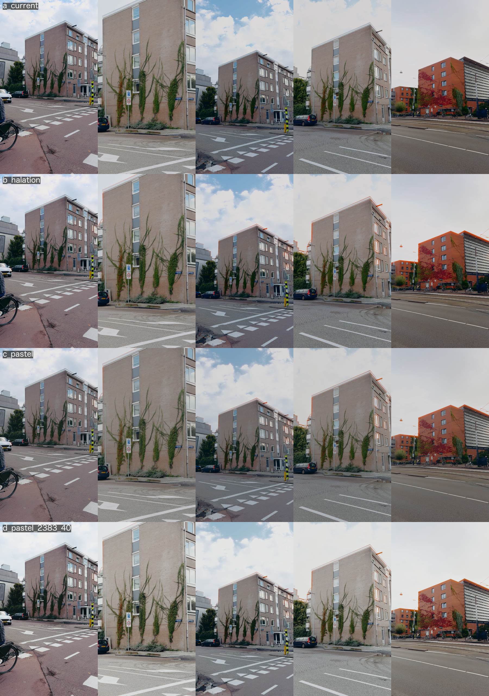

# ffgrade-macOS

One stop grading tool for iPhone ProRes + AppleLog footage. **This is a personal use tool, not a
product.**


**Why?** iPhone Pros 15th generation and newer are able to shoot in log, which retains enough depth
to edit professionally — dynamic range, shadow detail and 10-bit colour, good enough to sit
alongside footage from professional cinema cameras.

Getting there requires an understanding of colour spaces, LUTs and exposure, and usually
professional software. This tool gets about as much image quality out of iPhone footage as the
format actually holds, without opening an NLE. The final look is Kodak Portra, but that's one line
in `look.json`.

**Why not an existing app?** Log files are ordinary video, so any app opens them, but they look
flat and grey until they are converted and graded. The free tool that does that properly is
DaVinci Resolve, a full professional suite. Final Cut Pro converts Apple Log, but it is a paid
editor and the look is still yours to build. Editors that accept LUTs expect you to bring one. None
of them is quick: footage in, a good look, a file out.

**How?** Apple Log → graded Rec.709 in one ffmpeg pass. 10-bit preserved to delivery, tone curve
applied to luma only, LUTs generated rather than guessed. The app is a window over that chain — it
sets environment variables and reads the engine's events, and never builds a filter graph itself.

**Does it work?** Very well. Log holds real highlight headroom above diffuse white and none of the
HDR tone mapping or sharpening a normal phone capture bakes in. Getting that out of it is a tone
problem, and tone is something ffmpeg can do properly.

```sh
./app/make-app.sh        # builds dist/LogGrade.app
./scripts/check.sh       # lint, parity, bats, Swift suite
```

Build it optimised — the live preview runs the real chain per frame and a debug build is unusable.

---

## The preview is the render

Most grading tools approximate while you drag and render when you stop. This one runs the real
chain on every move, so the picture on screen is the picture you get. There is no preview button.

An approximate GPU tier was planned first. I measured how far it drifts before building it, found
the error worst exactly on saturated colour — which is what this footage is full of — and could not
explain where it came from. Seven candidate causes, none of them it. Shipping an interface whose
numbers are wrong in a way I can see but not account for was the worse option, so the tier was
refused rather than deferred.

→ [`adr/0009`](docs/adr/0009_THE_PREVIEW_STAYS_EXACT_UNTIL_THE_DIVERGENCE_IS_EXPLAINED.md)


---

## The default image is recorded, and moves on purpose

The chain is a fork of an earlier CLI, frozen at one commit and never touched again. It used to be the
reference: the default render had to match it byte for byte. That proved the fork survived, and then
it stopped the image from ever getting better than the old edit.

```sh
./tests/render-golden.sh                        # is the default render the recorded one?
./tests/render-golden.sh --regenerate "<why>"   # it moved on purpose; record it, with the reason
./scripts/check.sh --conformance                # has it departed from the precursor yet? (information)
```

A hash says the image changed, not that it improved. Both renders are kept in `dist/golden/` to judge
by eye.

→ [`adr/0014`](docs/adr/0014_THE_PRECURSOR_IS_PROVENANCE_NOT_THE_ORACLE.md) · [`PROVENANCE.md`](PROVENANCE.md)

---

## Four things that took the longest

**Tone on luma only.** Curve all three channels and a contrast move turns saturated colour neon.

**Grain at half resolution.** Instagram re-encodes everything; full-res grain comes back as blobs.

**Verify the colour tags after every encode.** Encoders don't reliably write them, and Rec.709
pixels tagged BT.2020 get transformed a second time by anything that trusts the tag. It looks like
someone bleached the footage.

**The crop is dragged per clip.** Default it to centre and a batch of twelve gives you twelve files
that all look finished and are all framed wrong. So there is no default at all: a deliverable that
crops is refused without an offset, and `CROP_OFFSET=centre` is how you say out loud that one clip does
not need a considered one.

---

## Film is more than a cube

A Portra LUT supplies colour and almost nothing else. What reads as film sits outside it, so it is
built as stages of its own, each measured against the render and absent from it until turned on:

- **Halation** — the warm glow bright things spill past their edges, added in linear light before
  Apple's conversion, where a sky and a white car are still different amounts of light.
- **A print** — Kodak 2383 and kin after the negative, as film is printed, at a strength.
- **Grain that follows the picture** — most in the midtones, receding into shadow and highlight.



Five clips, four rows: the shipped look, then halation, then a softer tone curve, then a 2383 print
at 40%. None of it is the default yet — the look is still a decision for an eye, not a test.

→ [`adr/0012`](docs/adr/0012_HALATION_IN_LINEAR_BEFORE_THE_CONVERSION.md)

---

## Deliver in any shape

A deliverable is a name, an aspect and a crop offset — not a size written into the pipeline. Two
ship as presets and the set is open:

```sh
DELIVERABLES=reels,feed ./scripts/grade.sh src/            # the two presets
DELIVERABLES=square:1:1,wide:16:9:400 ./scripts/grade.sh src/IMG_0609.mov
```

Height follows the aspect off one shared delivery width, because the platform re-encodes to a fixed
width and two deliverables that differed in it would be re-encoded differently for no reason. A
shape that is a crop of the master gets one, computed from the frame that is actually on disk; a
shape that is already the master's own gets no crop filter at all.

Sharpening and grain were tuned at 1080×1920 and are merely scaled away from it, so other sizes
render but are not yet judged.

→ [`adr/0010`](docs/adr/0010_A_DELIVERABLE_IS_DATA_NOT_A_CASE_BRANCH.md)

---

## Match a shoot to itself

Clips shot across an evening land differently under one curve, so each clip's exposure is measured
and its gamma solved to land them together. What they land *on* used to be a constant in
`look.json`: 609, the luma mean of one frame of one clip of one shoot. Right for that footage,
meaningless for anyone else's, and applied silently either way.

```sh
MATCH=batch ./scripts/grade.sh src/     # anchor on the median of these clips instead
```

The default is unchanged. It was kept to stay byte-identical to the precursor, a reason ADR 0014
withdrew, so whether it should change is an open question.

→ [`adr/0011`](docs/adr/0011_THE_EXPOSURE_REFERENCE_CAN_COME_FROM_THE_SHOOT.md)

---

## Layout

```
app/        Swift. GradeKit = models + engine adapter. LogGrade = the window.
scripts/    The engine. bash + ffmpeg. Start at lib.sh.
docs/       PIPELINE.md is the real documentation. adr/ holds the decisions.
look.json   The look. One source, every stage reads it.
tests/      Every test here exists because the thing it covers already broke.
```

→ [`USAGE.md`](USAGE.md) for the controls and the CLI underneath.

---

## Before it runs

Apple's conversion LUT is not in the repo — its licence forbids redistribution.
[`luts/apple/SOURCE.txt`](luts/apple/SOURCE.txt) says how to fetch it.

## Scope and licence

macOS on Intel, bash 3.2. Built for my footage and my deliverables.

[PolyForm Noncommercial 1.0.0](LICENSE). Run it, change it, share it, keep the attribution.
Commercial use needs permission. The film-emulation cubes in `luts/looks/` and `luts/print/` are
MIT-licensed work by someone else and keep their own terms.
