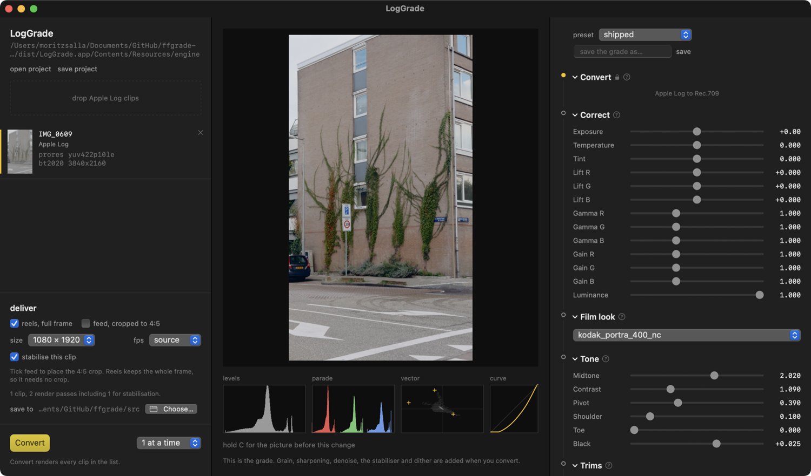
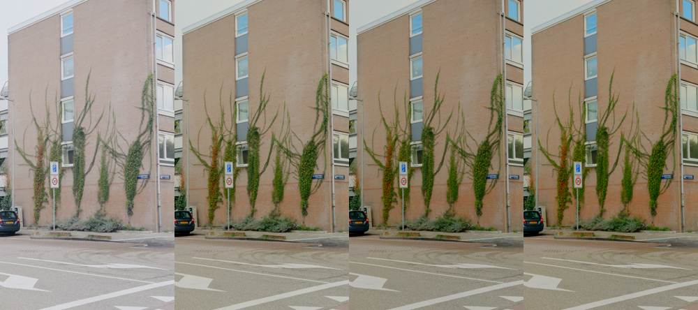
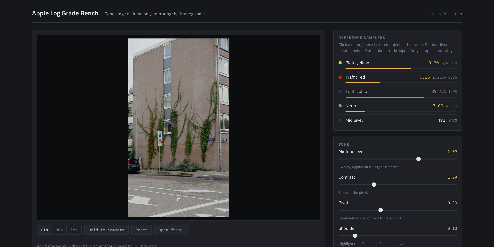

# ffgrade-macOS

One stop grading tool for iPhone ProRes + AppleLog footage. **This is a personal use tool, not a
product.**



**Why?** iPhone Pros 15th generation and newer are able to shoot in log, which retains enough depth
to edit professionally — dynamic range, shadow detail and 10-bit colour, good enough to sit
alongside footage from professional cinema cameras.

Getting there requires an understanding of colour spaces, LUTs and exposure, and usually
professional software. This tool gets about as much image quality out of iPhone footage as the
format actually holds, without opening an NLE. The final look is Kodak Portra, but that's one line
in `look.json`.

**How?** Apple Log → graded Rec.709 in one ffmpeg pass. 10-bit preserved to delivery, tone curve
applied to luma only, LUTs generated rather than guessed. The app is a window over that chain — it
sets environment variables and reads the engine's events, and never builds a filter graph itself.

**Does it work?** Very well. Log holds real highlight headroom above diffuse white and none of the
HDR tone mapping or sharpening a normal phone capture bakes in. Getting that out of it is a tone
problem, and tone is something ffmpeg can do properly.

```sh
./app/make-app.sh        # builds dist/LogGrade.app
./scripts/check.sh       # lint, parity, bats, Swift suite
```

Build it optimised — the live preview runs the real chain per frame and a debug build is unusable.

---

## The preview is the render

Most grading tools approximate while you drag and render when you stop. This one runs the real
chain on every move, so the picture on screen is the picture you get. There is no preview button.

An approximate GPU tier was planned first. I measured how far it drifts before building it, found
the error worst exactly on saturated colour — which is what this footage is full of — and could not
explain where it came from. Seven candidate causes, none of them it. Shipping an interface whose
numbers are wrong in a way I can see but not account for was the worse option, so the tier was
refused rather than deferred.

→ [`adr/0009`](docs/adr/0009_THE_PREVIEW_STAYS_EXACT_UNTIL_THE_DIVERGENCE_IS_EXPLAINED.md)



---

## The old version is the reference

The chain is a fork of an earlier CLI, frozen at one commit and never touched again.

```sh
./scripts/check.sh --conformance   # still byte-identical to the precursor?
```

Fixes here never reach it, which is the price. What it buys is something to be wrong against: the
engine can be rewritten and instrumented, and a diff says whether the image survived.

→ [`PROVENANCE.md`](PROVENANCE.md)

---

## Four things that took the longest

**Tone on luma only.** Curve all three channels and a contrast move turns saturated colour neon.

**Grain at half resolution.** Instagram re-encodes everything; full-res grain comes back as blobs.

**Verify the colour tags after every encode.** Encoders don't reliably write them, and Rec.709
pixels tagged BT.2020 get transformed a second time by anything that trusts the tag. It looks like
someone bleached the footage.

**The crop is dragged per clip.** Default it to centre and a batch of twelve gives you twelve files
that all look finished and are all framed wrong.



---

## Layout

```
app/        Swift. GradeKit = models + engine adapter. LogGrade = the window.
scripts/    The engine. bash + ffmpeg. Start at lib.sh.
docs/       PIPELINE.md is the real documentation. adr/ holds the decisions.
look.json   The look. One source, every stage reads it.
tests/      Every test here exists because the thing it covers already broke.
```

→ [`USAGE.md`](USAGE.md) for the controls and the CLI underneath.

---

## Before it runs

Apple's conversion LUT is not in the repo — its licence forbids redistribution.
[`luts/apple/SOURCE.txt`](luts/apple/SOURCE.txt) says how to fetch it.

## Scope and licence

macOS on Intel, bash 3.2. Built for my footage and my deliverables.

[PolyForm Noncommercial 1.0.0](LICENSE). Run it, change it, share it, keep the attribution.
Commercial use needs permission. The film-emulation cubes in `luts/looks/` are MIT-licensed work by
someone else and keep their own terms.
